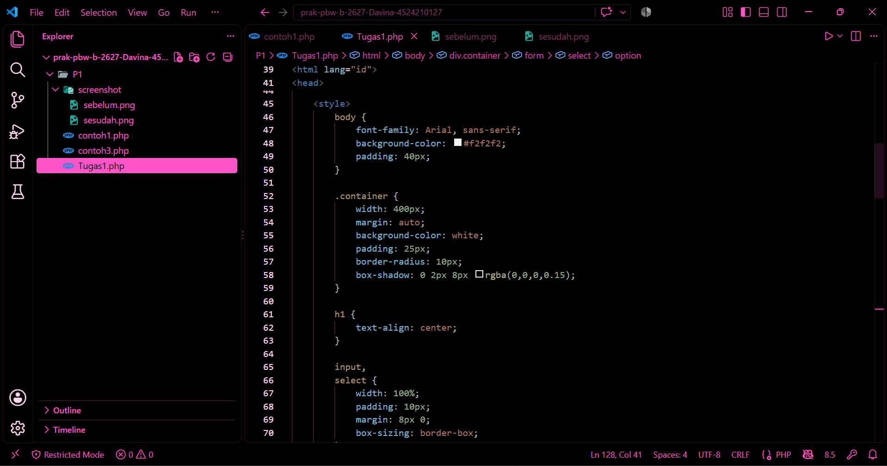
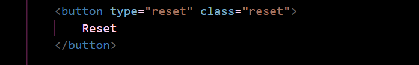
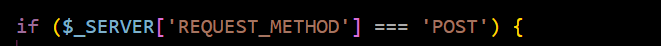
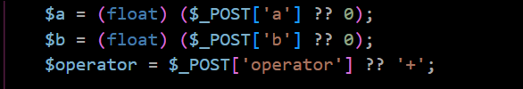
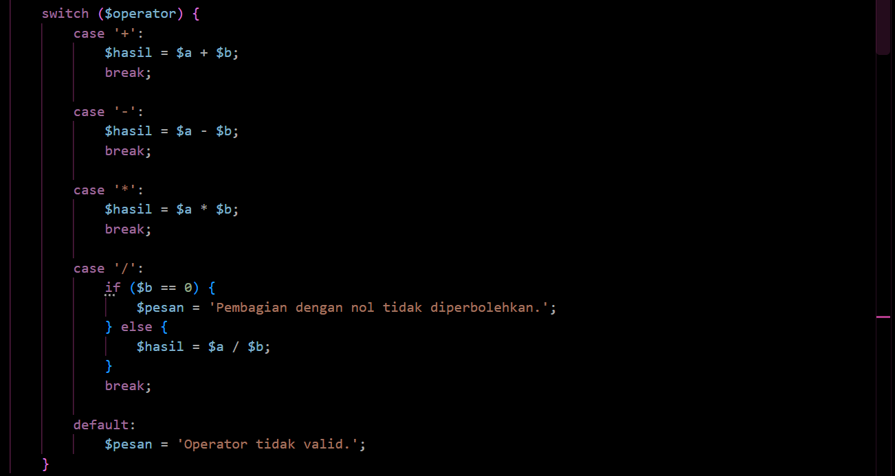
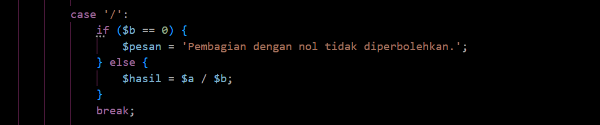
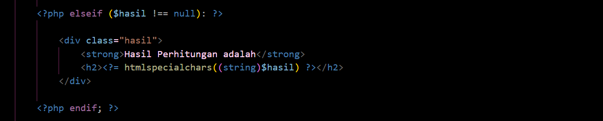
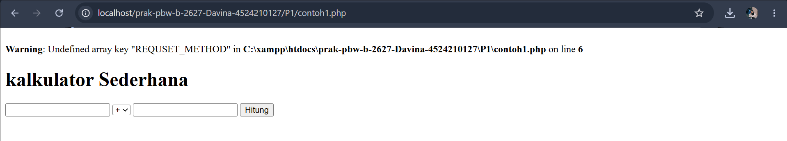
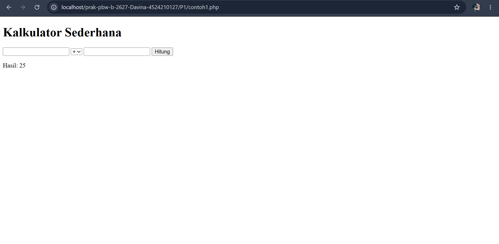
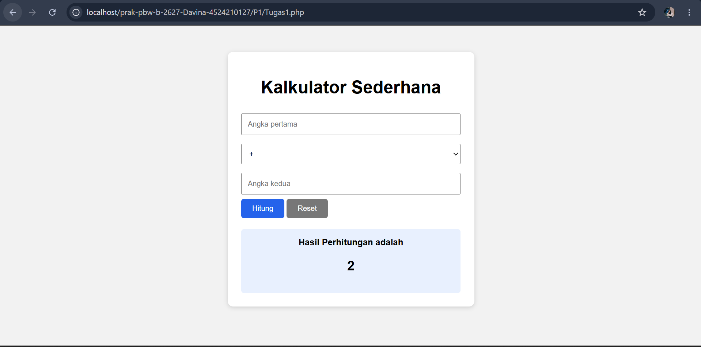

# LAPORAN PRAKTIKUM 1
## PEMROGRAMAN BERBASIS WEB

**Disusun Oleh:**  
Davina Arthamevia Azahra  
4524210127

---

# HASIL MODIFIKASI

## 1. Menambahkan styling

Pada program ini saya memodifikasi dengan menambahkan styling pada tampilan kalkulator agar terlihat lebih rapih dan menarik.

---

## 2. Menambahkan Tombol Reset

Menambahkan tombol Reset agar pengguna dapat mereset perhitungan dengan mudah hanya dengan mengklik tombol reset.

---

# 5 BAGIAN PENTING

## 1. Mengecek Method POST

Kode ini penting karena digunakan untuk memastikan apakah data dikirim menggunakan method POST. Jadi apabila pengguna menekan tombol Hitung, data dari form akan dikirim ke server untuk diproses.

---

## 2. Mengambil Data Form

Kode ini penting karena:

- `$a` digunakan untuk angka pertama
- `$b` digunakan untuk angka kedua
- `$operator` digunakan untuk operator yang akan digunakan
- `(float)` digunakan supaya angka yang diterima dapat diproses sebagai angka

---

## 3. Menggunakan Switch Dalam Proses Perhitungan

Kode ini penting karena merupakan kode utama dalam program, kode ini yang akan menentukan operasi hitung yang akan diproses berdasarkan dari operator yang dipilih.

---

## 4. Validasi Pembagian Dengan Nol

Kode ini penting karena digunakan untuk mencegah pembagian dengan angka Nol. Jadi, apabila pengguna melakukan operasi pembagian menggunakan angka Nol, maka program tidak akan melakukan perhitungan, tetapi akan menampilkan pesan "Pembagian dengan nol tidak diperbolehkan".

---

## 5. Menampilkan Hasil Perhitungan

Kode ini penting karena digunakan untuk menampilkan hasil dari operasi hitung yang telah diinput oleh pengguna.

---

# ERROR YANG SEMPAT MUNCUL

Program yang saya jalankan sempat mengalami error dengan menampilkan gambar dibawah ini.

Hal tersebut terjadi karena ternyata terdapat kesalahan penulisan dalam kode `$_SERVER['REQUEST_METHOD']`. Kesalahan penulisan diperbaiki dari `REQUSET_METHOD` menjadi `REQUEST_METHOD`. Setelah program dijalankan kembali melalui localhost, warning tersebut sudah tidak muncul dan program dapat digunakan kembali.

---

# HASIL SEBELUM MODIFIKASI

---

# HASIL SESUDAH MODIFIKASI

