# LAPORAN PRAKTIKUM 2
## PEMROGRAMAN BERBASIS WEB

**Disusun Oleh:**  
Davina Arthamevia Azahra  
4524210127

---

# HASIL MODIFIKASI

## 1. Menambahkan Prodi dan Email

Pada program ini saya memodifikasi dengan menambahkan data mahasiswa berupa prodi dan email agar data menjadi lebih lengkap.

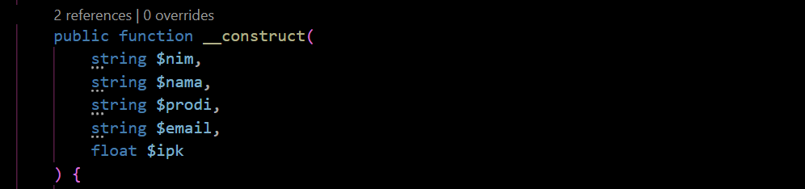

---

## 2. Menambahkan Kondisi Status Akademik

Pada program ini saya memodifikasi dengan menambahkan status akademik yang dilihat dari nilai IPK.

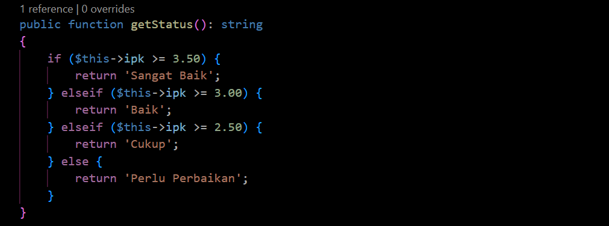

---

## 3. Menambahkan Styling

Agar tampilan program menarik saya memodifikasinya dengan menambahkan CSS sehingga output yang keluar lebih menarik.

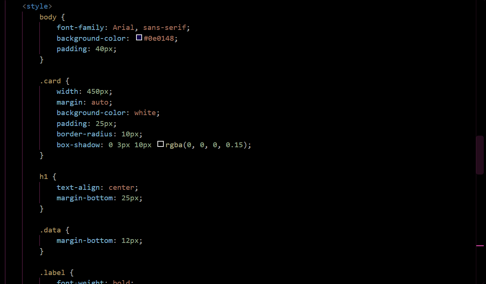

---

# 5 BAGIAN PENTING

## 1. Interface Identitas

Interface termasuk dalam kode penting karena digunakan untuk menentukan method yang harus dimiliki oleh class yang mengimplementasikannya. Dalam program ini, class Mahasiswa mengimplementasikan interface Identitas, sehingga harus memiliki method `ringkasan()`.

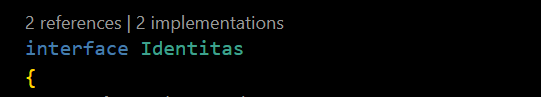

---

## 2. Class Mahasiswa

Class Mahasiswa merupakan kode penting karena kode ini berperan dalam membuat objek mahasiswa. Class ini menyimpan data mahasiswa seperti NIM, nama, prodi, email, dan IPK. `implements Identitas` menunjukkan bahwa class ini menggunakan interface Identitas.

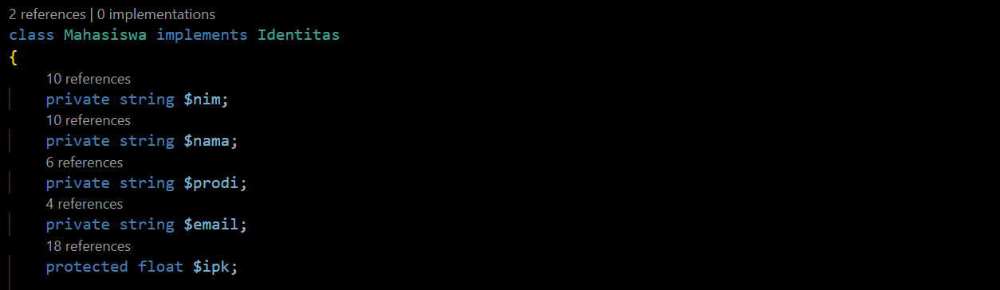

---

## 3. Constructor

Constructor merupakan kode penting karena berfungsi untuk memberikan nilai awal ketika objek Mahasiswa dibuat. Data NIM, nama, prodi, email, dan IPK langsung dimasukkan ketika objek dibuat.

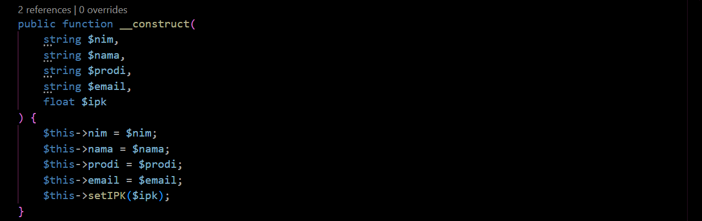

---

## 4. Validasi IPK

Kode ini penting karena digunakan untuk memastikan nilai IPK berada pada rentang 0 sampai 4. Jika pengguna memberikan IPK di luar rentang tersebut, program akan menghasilkan exception berupa pesan bahwa IPK harus 0 sampai 4.

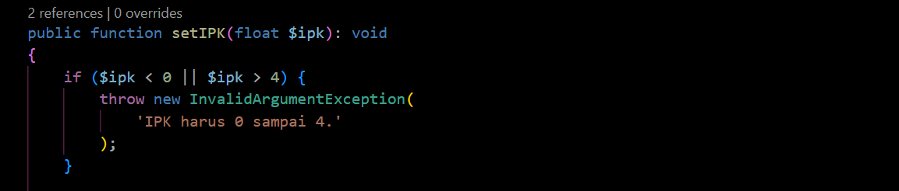

---

## 5. Kondisi Status Akademik

Kode ini merupakan hasil modifikasi yang juga berperan penting untuk menampilkan status akademik dari mahasiswa. Program menggunakan kondisi if-elseif-else untuk menentukan status akademik berdasarkan IPK mahasiswa.

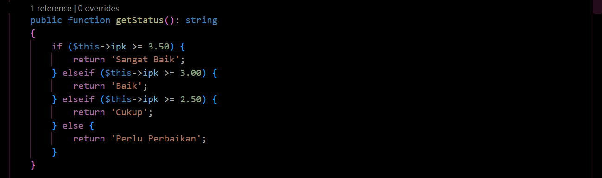

---

# ERROR YANG SEMPAT MUNCUL

Pada saat saya membuat IPK menjadi 5.00 output program setelah dijalankan menjadi eror.

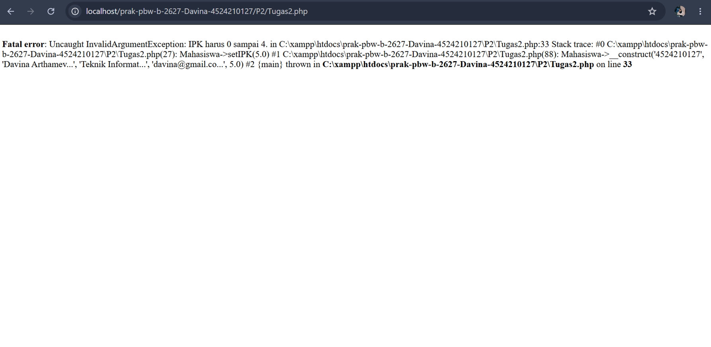

Hal tersebut terjadi karena nilai IPK yang diberikan tidak sesuai dengan kondisi validasi pada method `setIPK()`. Program memiliki kondisi `if ($ipk < 0 || $ipk > 4)` yang akan menghasilkan `InvalidArgumentException` apabila nilai IPK kurang dari 0 atau lebih dari 4.

Perbaikan dilakukan dengan mengganti nilai IPK yang salah menjadi nilai yang berada dalam rentang 0 sampai 4.

---

# HASIL SEBELUM MODIFIKASI

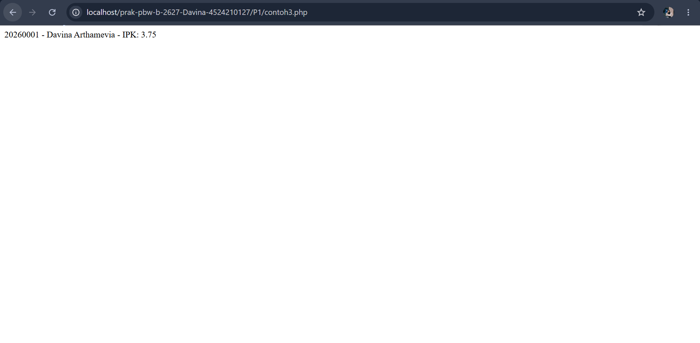

---

# HASIL SESUDAH MODIFIKASI

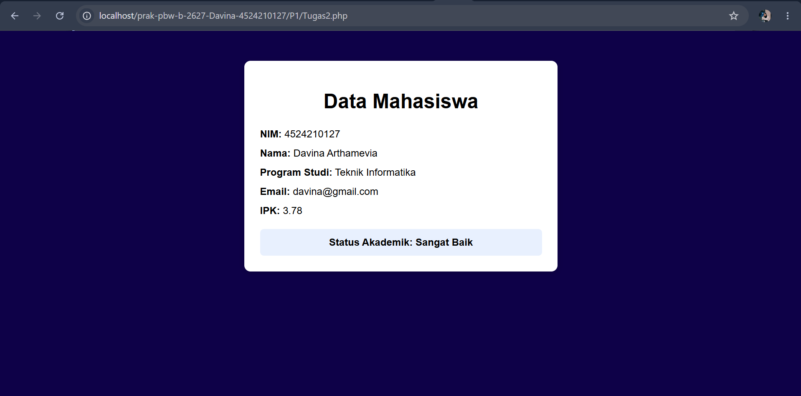