# LAPORAN PRAKTIKUM 3

## PEMROGRAMAN BERBASIS WEB

**Disusun Oleh:**  
Davina Arthamevia Azahra (4524210127)

---

# BAGIAN YANG MODIFIKASI

## 1. Menambahkan Nomor HP dan Menambahkan Status Mahasiswa

Pada program ini saya memodifikasi tabel mahasiswa dengan menambahkan data nomor HP dan status mahasiswa agar informasi mahasiswa menjadi lebih lengkap.

### Dokumentasi

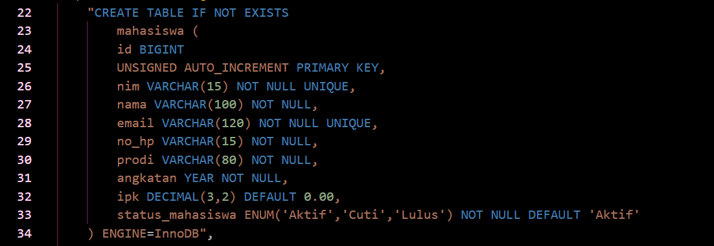

---

## 2. Menambahkan Tabel Nilai

Pada program ini saya memodifikasi database dengan menambahkan tabel nilai yang digunakan untuk menyimpan nilai mahasiswa berdasarkan mata kuliah yang terdapat pada KRS.

### Dokumentasi

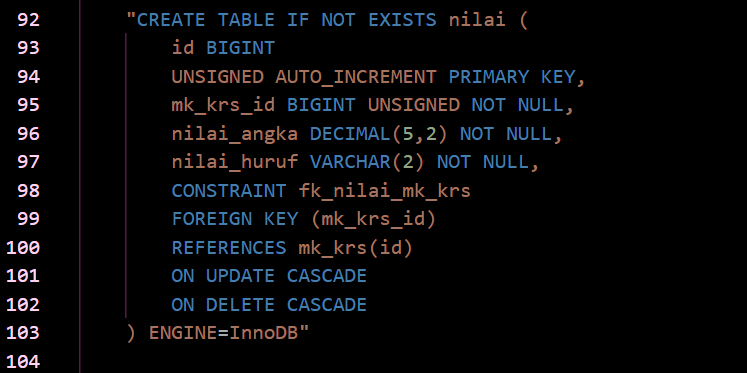

---

# 5 BAGIAN PENTING

## 1. Koneksi PHP

Koneksi PHP termasuk dalam kode penting karena digunakan untuk menghubungkan program PHP dengan database MySQL melalui file `koneksi.php`. Dengan adanya koneksi ini, program dapat menjalankan query dan mengakses database.

### Dokumentasi

---

## 2. Membuat Database

Kode ini penting karena digunakan untuk membuat database `akademik`. Program akan mengecek terlebih dahulu apakah database sudah tersedia atau belum sebelum membuatnya.

### Dokumentasi

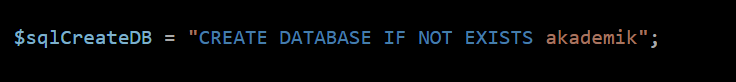

---

## 3. Membuat Tabel

Kode ini penting karena digunakan untuk membuat tabel yang dibutuhkan dalam database akademik, seperti tabel `mahasiswa`, `dosen`, `mata_kuliah`, `krs`, `mk_krs`, dan `nilai`.

### Dokumentasi

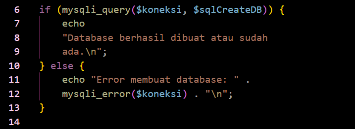

---

## 4. Menggunakan Foreign Key

Kode ini penting karena digunakan untuk menghubungkan tabel yang saling berhubungan. Salah satunya adalah tabel `nilai` yang menggunakan `mk_krs_id` sebagai foreign key yang terhubung dengan tabel `mk_krs`.

### Dokumentasi

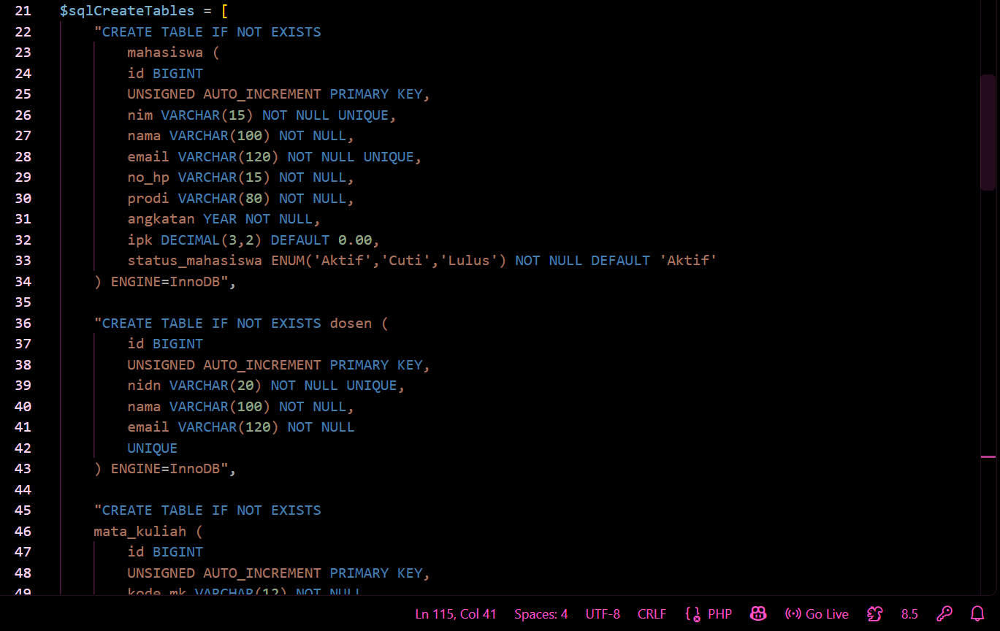

---

## 5. Menjalankan Query dengan Foreach

Kode ini penting karena digunakan untuk menjalankan seluruh query pembuatan tabel yang terdapat dalam `$sqlCreateTables`. Dengan menggunakan `foreach`, setiap query tabel dapat dijalankan secara berurutan.

### Dokumentasi

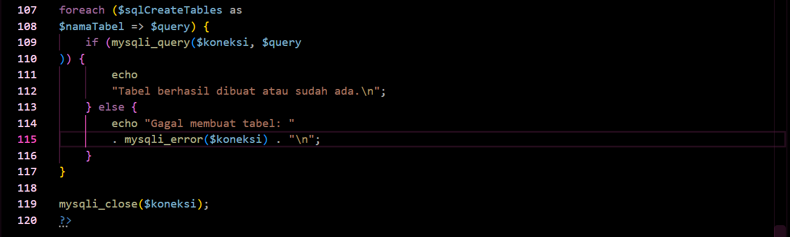

---

# ERROR YANG SEMPAT MUNCUL

### Dokumentasi Error

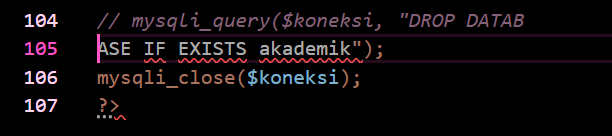

Hal tersebut terjadi karena terdapat kesalahan pada penulisan kode, saya sempat keliru dalam menyalin kode dari materi sehingga terjadi error pada saat dijalankan

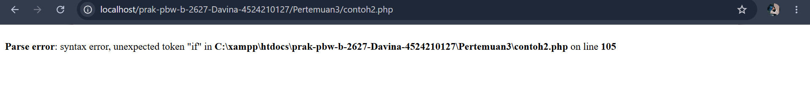

## Setelah Perbaikan

Saya memperbaiki kesalahan dalam penulisan kode, sehingga kode menjadi bisa dijalankan

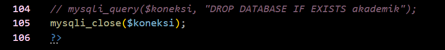

# HASIL SEBELUM MODIFIKASI

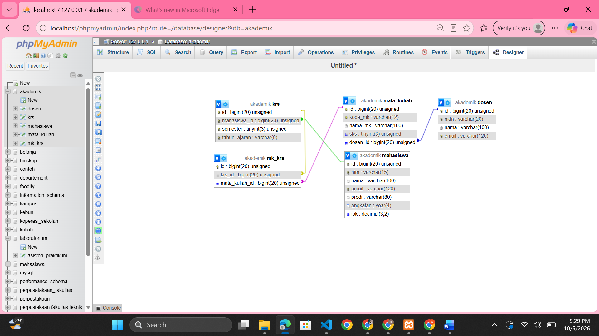

# HASIL SESUDAH MODIFIKASI

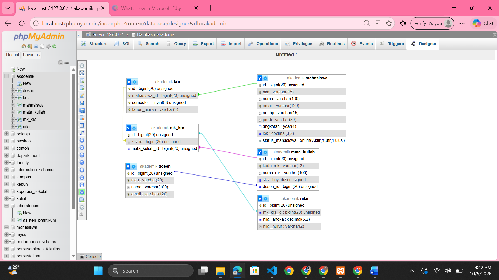
