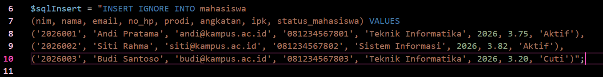
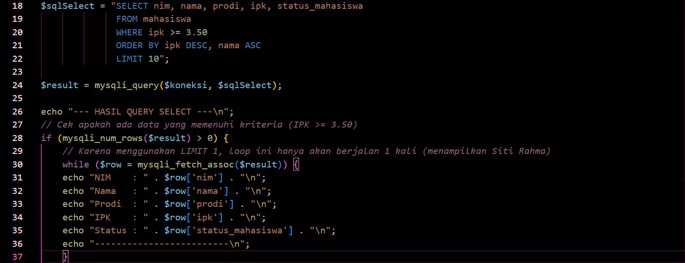
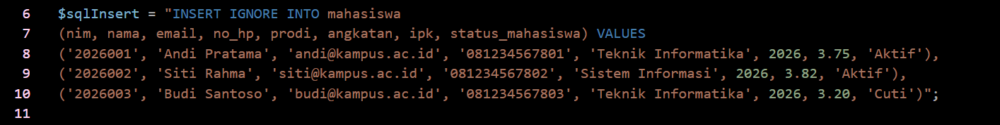
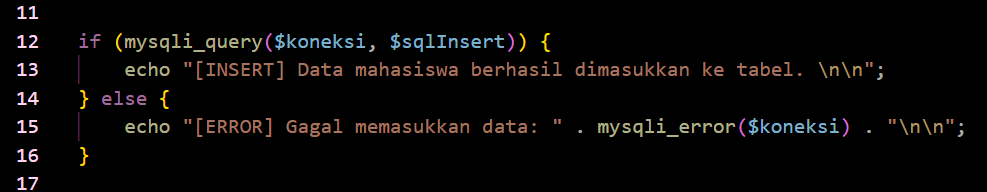
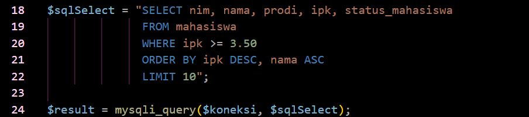
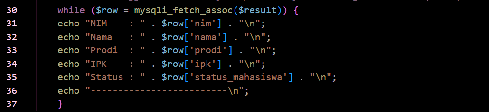
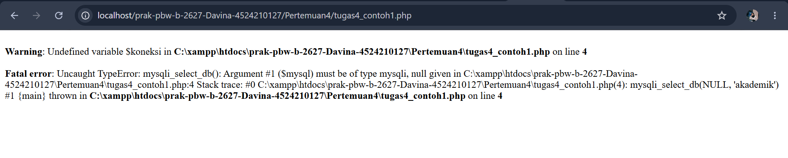
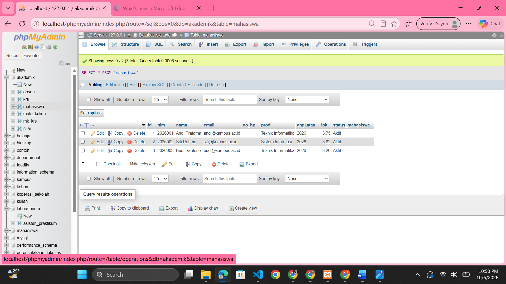
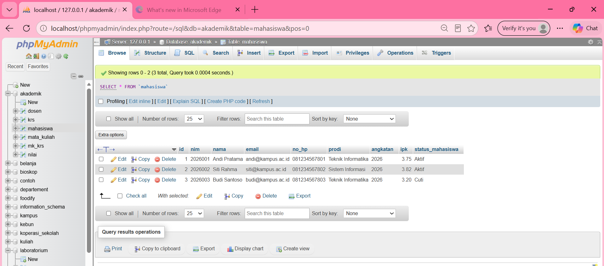

# LAPORAN PRAKTIKUM 4
## PEMROGRAMAN BERBASIS WEB
## CONTOH 1

**Disusun Oleh:**  
Davina Arthamevia Azahra (4524210127)

---

# HASIL MODIFIKASI

## 1. Menambahkan Nomor HP

Pada program ini saya memodifikasi query INSERT dengan menambahkan field nomor HP pada data mahasiswa. Sebelumnya data yang dimasukkan hanya terdiri dari NIM, nama, email, prodi, angkatan, dan IPK. Dengan penambahan nomor HP, data mahasiswa menjadi lebih lengkap.

### Dokumentasi

---

## 2. Menampilkan dan Memperbarui Status Mahasiswa

Pada program ini saya memodifikasi query SELECT dengan menambahkan field status mahasiswa. Status mahasiswa ditampilkan bersama dengan NIM, nama, prodi, dan IPK sehingga informasi yang ditampilkan menjadi lebih lengkap. Pada kode sebelumnya status mahasiswa masih berdasarkan data lama dan dalam modifikasi ini sudah diperbarui datanya

### Dokumentasi

---

# 5 BAGIAN PENTING

## 1. Memilih Database

Kode ini penting karena digunakan untuk memilih database akademik yang akan digunakan oleh program. Setelah database dipilih, query selanjutnya dapat dijalankan pada database tersebut.

### Dokumentasi

---

## 2. Query INSERT

Kode ini penting karena digunakan untuk memasukkan data mahasiswa ke dalam tabel mahasiswa. Dalam satu query terdapat tiga data mahasiswa yang dimasukkan sekaligus.

### Dokumentasi

---

## 3. Menjalankan Query Insert

Kode ini penting karena digunakan untuk menjalankan query INSERT. Program juga melakukan pengecekan apakah query berhasil atau mengalami error.

### Dokumentasi

---

## 4. Query SELECT dengan WHERE

Kode ini penting karena digunakan untuk mengambil data mahasiswa berdasarkan kondisi tertentu. WHERE ipk >= 3.50 digunakan untuk mengambil mahasiswa dengan IPK minimal 3.50.
Selain itu, ORDER BY ipk DESC digunakan untuk mengurutkan IPK dari terbesar ke terkecil.

### Dokumentasi

---

## 5. Mengambil dan Menampilkan Data

Kode ini penting karena digunakan untuk mengambil dan menampilkan setiap baris data dari hasil query SELECT. mysqli_fetch_assoc() mengambil data dalam bentuk array dengan nama kolom sebagai key.

### Dokumentasi

---

# ERROR YANG SEMPAT MUNCUL

Pada saat menjalankan program, sempat muncul error pada proses koneksi terhadap mysql dari phpnya.

### Dokumentasi Error

Hal tersebut terjadi karena kurangnya kode koneksi php. Perbaikannya adalah dengan menambahkan kode koneksi php agar langsung terhubung dengan MySQL PHP

### Hasil Setelah Perbaikan

# HASIL SEBELUM MODIFIKASI

# HASIL SESUDAH MODIFIKASI

