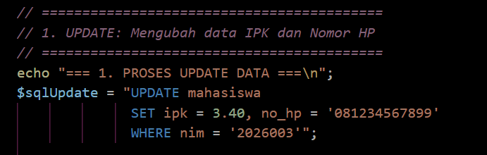
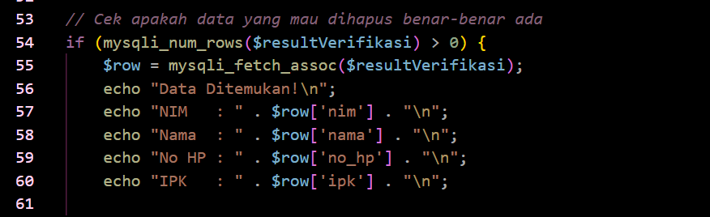
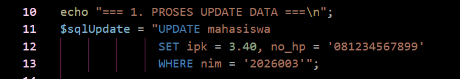
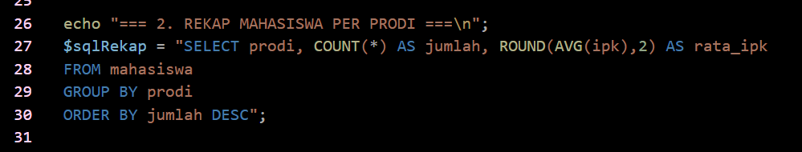
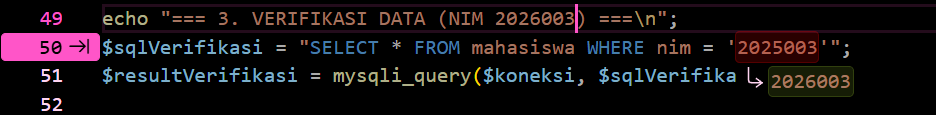
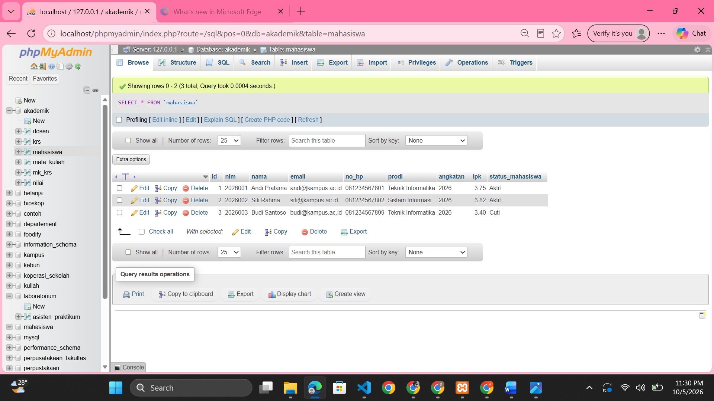

# LAPORAN PRAKTIKUM 4
## PEMROGRAMAN BERBASIS WEB
## CONTOH 2

**Disusun Oleh:**  
Davina Arthamevia Azahra (4524210127)

---

# HASIL MODIFIKASI

## 1. Menambahkan Nomor HP pada Proses UPDATE

Pada program ini saya memodifikasi proses `UPDATE` dengan menambahkan perubahan nomor HP mahasiswa. Jadi, selain mengubah IPK, program juga dapat memperbarui nomor HP mahasiswa berdasarkan NIM.

### Dokumentasi

---

## 2. Menampilkan Nomor HP pada Proses Verifikasi

Pada program ini saya memodifikasi bagian verifikasi data sebelum penghapusan dengan menambahkan nomor HP. Sebelumnya program hanya menampilkan NIM, nama, dan IPK. Setelah dimodifikasi, nomor HP mahasiswa juga ditampilkan sehingga informasi data mahasiswa menjadi lebih lengkap.

### Dokumentasi

---

# 5 BAGIAN PENTING

## 1. Memilih Database

Kode ini penting karena digunakan untuk memilih database `akademik` yang akan digunakan oleh program. Setelah database dipilih, proses `UPDATE`, `SELECT`, dan `DELETE` dapat dilakukan pada database tersebut.

### Dokumentasi

---

## 2. UPDATE Data Mahasiswa

Kode ini penting karena digunakan untuk mengubah data mahasiswa yang sudah tersimpan di dalam database. Pada program ini data IPK dan nomor HP mahasiswa dengan NIM `2026003` diubah menggunakan query `UPDATE`.

### Dokumentasi

---

## 3. GROUP BY untuk Rekap Data

Kode ini penting karena digunakan untuk mengelompokkan data mahasiswa berdasarkan prodi. `COUNT(*)` digunakan untuk menghitung jumlah mahasiswa pada setiap prodi, sedangkan `AVG(ipk)` digunakan untuk menghitung rata-rata IPK setiap prodi.

### Dokumentasi

---

## 4. SELECT untuk Verifikasi Data

Kode ini penting karena digunakan untuk mengecek terlebih dahulu apakah data mahasiswa dengan NIM `2026003` tersedia sebelum dilakukan proses penghapusan. Data yang ditemukan kemudian ditampilkan berupa NIM, nama, nomor HP, dan IPK.

### Dokumentasi

---

## 5. DELETE Data Mahasiswa

Kode ini penting karena digunakan untuk menghapus data mahasiswa dari database berdasarkan NIM. Proses penghapusan dilakukan setelah program memastikan bahwa data mahasiswa tersebut tersedia.

### Dokumentasi

---

# ERROR YANG SEMPAT MUNCUL

Pada saat menjalankan program, sempat muncul error karena data mahasiswa dengan NIM `2026003` tidak ditemukan perubahan

### Dokumentasi Error

Hal tersebut terjadi karena ternyata terdapat kesalahan data antara pada database dan kode, dikode tertulisnya `2025003` sehingga datapun tidak terupdate karena NIM tersebut tidak ada dalam database

Perbaikan dilakukan dengan memperbaiki NIM dalam kode, NIM pada kode dan database harus sesuai sehingga data balance dan berhasil menampilkan update 

### Hasil Setelah Perbaikan

# HASIL SEBELUM MODIFIKASI

# HASIL SESUDAH MODIFIKASI
